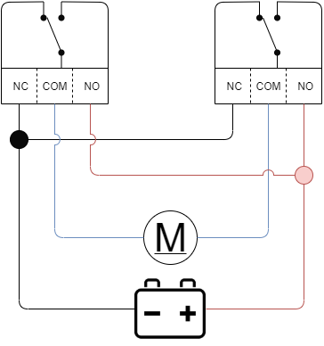

# power fold Mirrors
Arduino based power folding mirrors module.

A module that should inegrate with the vehicles canbus system and trigger power fold mirrors when the car is locked or unlocked.

If the ignition is active it should open the mirrors then disable the system. 

It will target a 2010 Focus for its can messages.

Essentially the arduino will use a simple Hbridge to toggle a motor for 5 seconds in either direction. 

It expects the actual mirror mechanism to have switches that will stop the mirror should it reach the fully closed or fully open positions.

In the future it would me neat to add a switch to allow the mirrors to be manually opened or closed. It would be cool to also have puddle lights and to optionaly open the mirrors when the drivers dooor os opened. Not just when the vehicle is unlocked.

# wiring

The motors need wiring in prarlel to a pair of SPDT relays to create a kind of H-bridge. So long as only *one* relay is activated at a time the motors will turn in one direction or the other. There is the possiblity that during the transition both relays could be active for a small period of time as the coil inside the relay discharges.

# can messages

The focus (and many other cars) have multiple can busses at different speeds, MSCAN (Medium speed), HSCAN/HICAN (High speed) and a low speed option. Currently messages that appear to relate to the doors locking and unlocking come from the MSCAN. Still trying to find messages relating to ignition. Hopefuly that will be on MSCAN too otherwise i will need two controllers to connect to each one.

Connections to both busses can be made from the ODB port for early testing. 

*Source: https://forscan.org/forum/viewtopic.php?t=4*

However, it would be better to tap into the bus elsewhere for a permanent connection. Near the main junction box behind the glov compartment.

According to the wiring diagram located here: https://www.fordownersclub.com/forums/topic/42898-ford-focus-full-wiring-schematics-mk225-and-mk3/

MSCAN can be tapped into from the Passenger junction boxes. Specifically, connectors C103 or C99. This is listed as version 7.4. I assume that is the version of the junction box.

